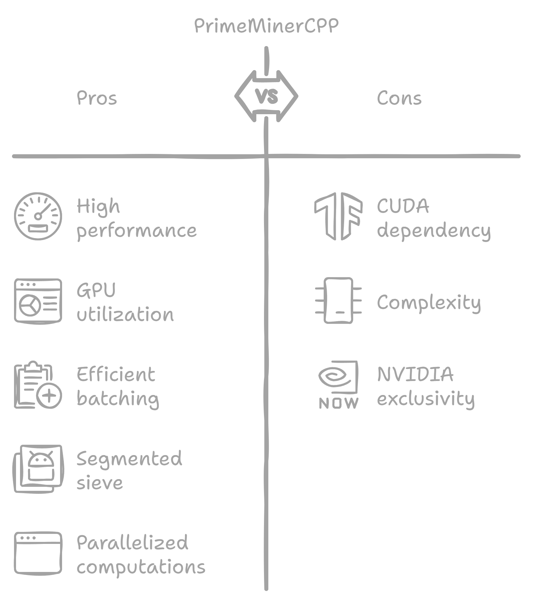
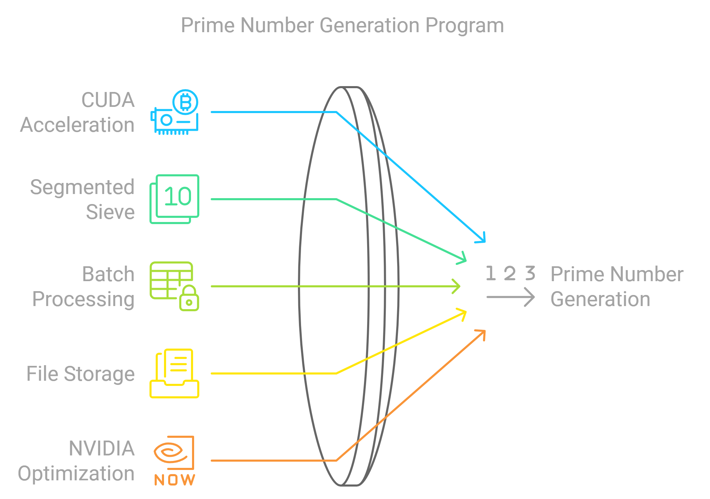
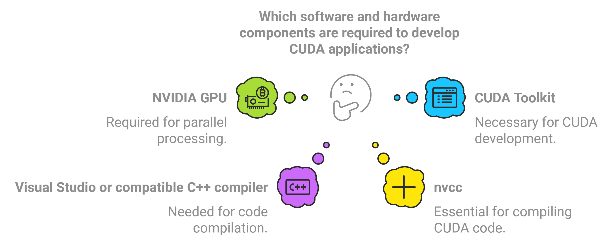

<p align="center">
   
</p>

# PrimeMinerCPP

**PrimeMinerCPP** is a high-performance prime number mining program implemented in CUDA and C++, designed to utilize the GPU for highly parallelized computations of prime numbers. The program uses the segmented sieve of Eratosthenes to efficiently find large primes in batches, leveraging the power of NVIDIA GPUs.

<div align="center">
   
</div>

## Features

- **CUDA-accelerated** prime number generation, allowing the program to utilize your GPU for parallel computation.
- **Segmented Sieve of Eratosthenes**, optimized for finding primes in large ranges.
- **Batch processing**: Finds primes in large batches, reporting the number of primes found, total primes, and the number of digits in the largest prime found in each batch.
- **Efficient file storage**: Saves primes to a binary file after each batch, allowing the program to resume from where it left off.
- **Conversion to Plain Text**: Provides an option to convert the binary stored primes to a human-readable plain text format.
- **Optimized for NVIDIA GPUs**: Uses CUDA to maximize performance on compatible GPUs.

<div align="center">
   
</div>

## Author

PrimeMinerCPP is developed by **Its3rr0rsWRLD** (aka **3rr0r**).

## Installation

### Prerequisites

To run PrimeMinerCPP, you will need:

- An **NVIDIA GPU** with CUDA support (Compute Capability 3.0 or higher).
- **CUDA Toolkit** installed on your machine. Download from the [NVIDIA Developer Site](https://developer.nvidia.com/cuda-downloads).
- **Visual Studio** (for Windows) or a compatible C++ compiler.
- **nvcc**: The NVIDIA CUDA Compiler.

<div align="center">
   
</div>

### Building the Project

1. **Clone the repository** (or download the source code):
   ```bash
   git clone https://github.com/Its3rr0rsWRLD/PrimeMinerCPP.git
   cd PrimeMinerCPP
   ```

2. **Compile the program using `nvcc`** (replace `sm_60` with your GPU's architecture):
   ```bash
   nvcc -O3 -arch=sm_60 -o PrimeMiner main.cu
   ```

3. **Run the program**:
   ```bash
   ./PrimeMiner
   ```

## Usage

After compilation, the program will begin computing prime numbers starting from the last prime saved in the `primes.bin` file.

### Key Features:

- **Batch Output**: The program outputs the following information for each batch:
  - Number of primes found in the current batch.
  - Total number of primes found so far.
  - The number of digits in the largest prime found in the batch.
  - Time taken for the batch to complete.

- **Resuming Computation**: The program automatically resumes from the last prime stored in the `primes.bin` file, ensuring continuity across sessions.

- **Conversion to Plain Text**: Use the `--read` flag to convert the binary stored primes to a human-readable plain text file.

### Running the Program

- **Start Prime Calculation**:
  ```bash
  ./PrimeMiner
  ```

- **Limit the Number of Batches**:
  ```bash
  ./PrimeMiner --limit 10
  ```

- **Convert Binary Primes to Plain Text**:
  ```bash
  ./PrimeMiner --read
  ```

### Sample Output:

```
Batch 1: Found 500 primes. | Total Primes: 500 | Longest Prime Digits: 3 | Batch Runtime: 0.12 seconds
Batch 2: Found 430 primes. | Total Primes: 930 | Longest Prime Digits: 4 | Batch Runtime: 0.11 seconds
```

## Configuration

You can modify the following constants in `main.cu` to optimize for your GPU or range size:

- **`SEGMENT_SIZE`**: Defines the size of the number segment that each batch will process. Larger sizes will use more memory and GPU power.
- **`THREADS_PER_BLOCK`**: The number of threads per block. Set based on your GPU's capabilities (common values: 128, 256, or 512).

## Resuming from Last Prime

The program saves each prime found to `primes.bin` in a binary format using delta encoding. When restarted, it will automatically resume from the last prime saved in the file, making it easy to run long mining sessions without losing progress.

### File Structure:
- **`primes.bin`**: Contains the delta-encoded list of primes in binary format.
- **`primes_converted.txt`**: Generated when using the `--read` flag, containing the list of primes in plain text format.

## Conversion to Plain Text

To convert the binary stored primes to a human-readable plain text file, use the `--read` flag. This will generate a `primes_converted.txt` file with all the primes separated by spaces.

### Example:
```bash
./PrimeMiner --read
```
Output:
```
Conversion complete. Primes written to primes_converted.txt
```

## Performance

PrimeMinerCPP is designed for performance, taking advantage of CUDA and parallel processing on the GPU. The number of primes found per batch, as well as the runtime for each batch, will depend on the GPU model, CUDA configuration, and segment size.

### Known Performance Optimizations:

- **Shared memory**: For small primes (less than √N), shared memory usage improves performance.
- **Thread block size**: Adjusting thread block sizes (`THREADS_PER_BLOCK`) for your GPU can significantly impact performance.

## License

This project is open-source under the [MIT License](LICENSE).

## Author

Developed by **Its3rr0rsWRLD/3rr0r**.